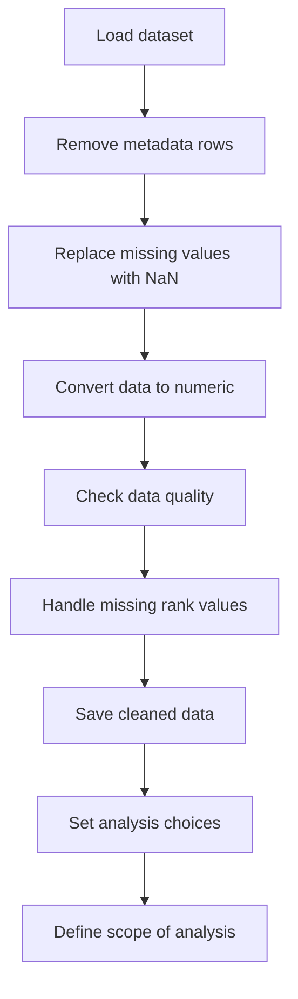
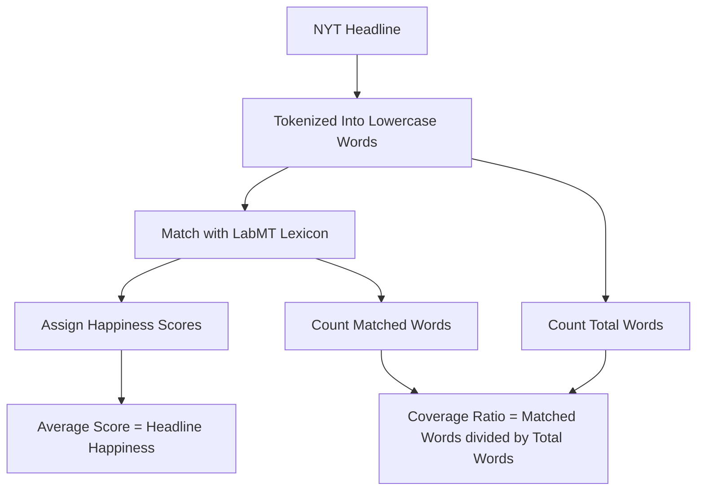
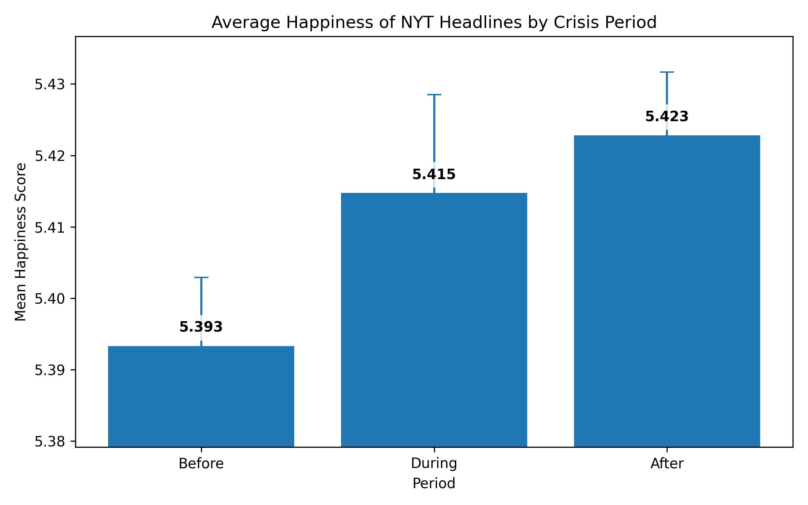
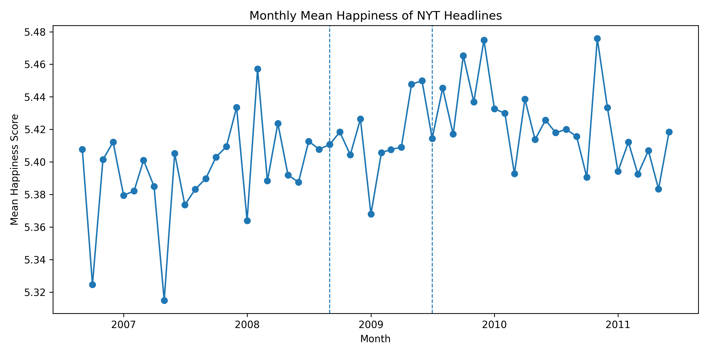
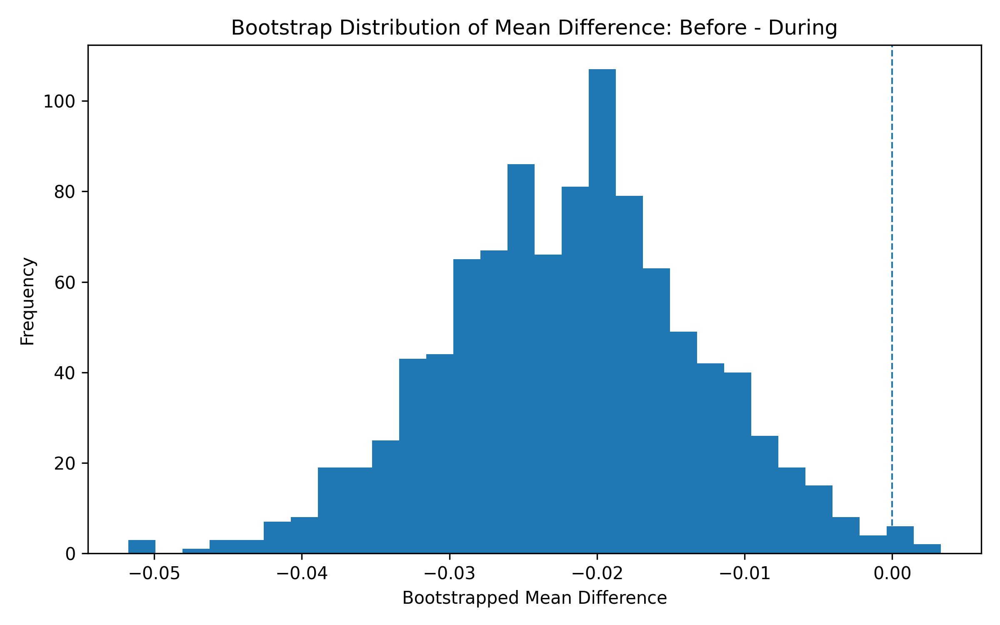
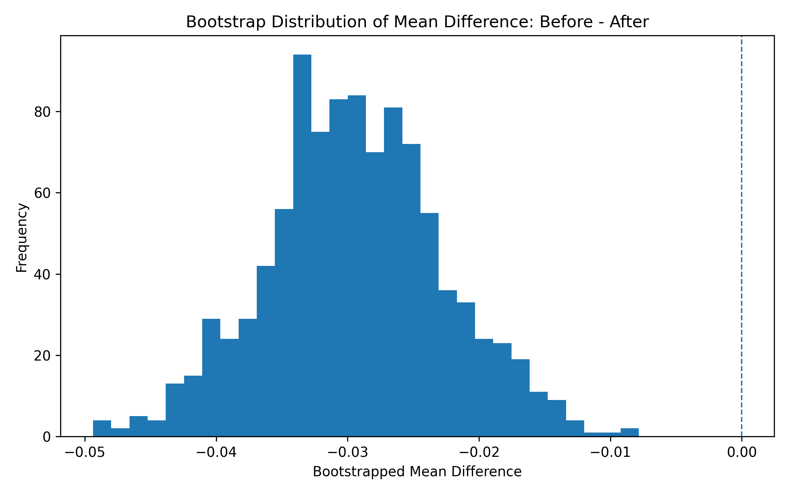
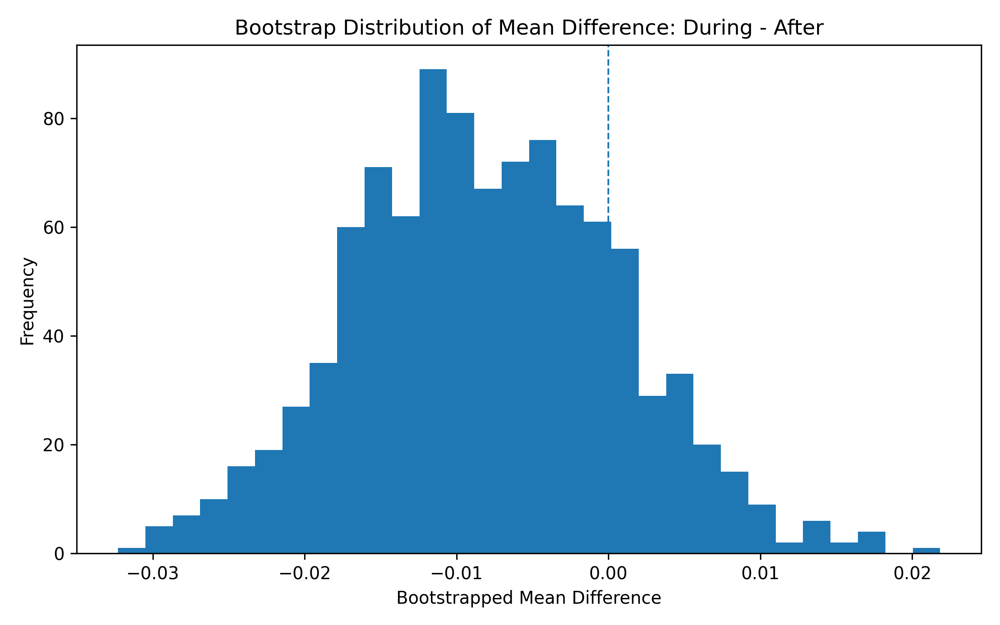

# 🎭Hedonometer Project: Emotional Tone in NYT Headlines During Financial Crisis📉💸

## Introduction
This project examines how the emotional tone of New York Times (NYT) headlines evolved during the financial crisis period (2006–2011). As a major news outlet, the NYT provides a useful lens for understanding how large-scale economic events may be reflected in journalistic language.

To measure emotional tone, we use the LabMT lexicon, which assigns happiness scores to words based on crowd-sourced evaluations. Before applying this method to NYT headlines, we briefly explore the properties of the lexicon to better understand how it represents emotional meaning.

We then apply this approach to a dataset of NYT headlines collected via the New York Times Archive API, and analyze how emotional tone changes over time across the pre-crisis, crisis, and post-crisis periods.


## Research Question
How did the overall emotional tone of New York Times headlines evolve during the financial crisis period (2006–2011)?

<br>

---

## Methodological Preparation: Understanding the LabMT Lexicon
Before applying the LabMT lexicon to NYT headlines, we first take a closer look at the dataset itself. The LabMT 1.0 dataset contains English words rated for happiness by crowd workers. Using Python, we explore how these happiness scores are distributed and how words are used across different corpora.

This step helps us better understand what the lexicon is actually capturing, and gives us a clearer basis for interpreting the results in our main analysis.

### LabMT Dataset
We use the labMT 1.0 dataset (Dodds et al., 2011), which includes 10,222 English words rated for happiness.

Each word has:
- An average happiness score
- A standard deviation of ratings
- Frequency ranks in four corpora:
  - Twitter
  - Google Books
  - New York Times
  - Lyrics

### Data Dictionary
Below is a description of each column in the dataset, including its meaning, data type, and notes on missing values.
| Column | Type | Meaning | Missing Values |
|------|------|------|------|
| word | string | The English word being evaluated in the dataset | None |
| happiness_rank | integer | Rank of the word based on its average happiness score (1 = highest happiness score) | None |
| happiness_average | float | Average happiness score assigned by Mechanical Turk raters on a 1–9 scale | None |
| happiness_standard_deviation | float | Standard deviation of happiness ratings, indicating disagreement among raters | None |
| twitter_rank | float | Frequency rank of the word in the Twitter corpus | 5,222 missing values (words not in the top 5,000) |
| google_rank | float | Frequency rank of the word in the Google Books corpus | 5,222 missing values (words not in the top 5,000) |
| nyt_rank | float | Frequency rank of the word in the New York Times corpus | 5,222 missing values (words not in the top 5,000) |
| lyrics_rank | float | Frequency rank of the word in the song lyrics corpus | 5,222 missing values (words not in the top 5,000) |


### Method
How we explored lexicon:


### Distribution of Happiness Scores


To understand the overall structure of the dataset, we examine the distribution of happiness scores using both summary statistics and a histogram. The mean happiness score is approximately 5.38, and the median is very close to this value, indicating that the distribution is centered around the middle of the scale. The standard deviation is about 1.08, suggesting a moderate spread in the data.

The range of values extends from approximately 1.3 to 8.5, showing that the lexicon includes both very negative and very positive words. However, the 5th and 95th percentiles (around 3.18 and 7.08) indicate that most words fall within a narrower central interval, with relatively few extreme values.

Visually, the histogram shows that the distribution is not perfectly symmetric. While it is roughly bell-shaped, there is a slight skew toward higher (more positive) values, meaning that moderately positive words are more common than strongly negative ones. The right tail extends into high happiness scores, but both tails are relatively thin, indicating that extreme values are less frequent.

Overall, the distribution suggests that language in the labMT lexicon is concentrated around neutral to moderately positive emotional values, with fewer words expressing strong negativity or extreme positivity. This pattern implies a bias toward mildly positive expression in commonly used language.

### Happiness vs Disagreement


We examine the relationship between happiness scores and disagreement (standard deviation) using a scatterplot. While one might initially expect that words with very high or very low happiness scores would have more consistent evaluations, the plot suggests the opposite pattern.

The scatterplot shows a clear fan-shaped distribution. Words near the neutral midpoint (around a happiness score of 5) tend to have lower disagreement, while words further away from neutrality—either more positive or more negative—exhibit higher levels of disagreement. This indicates that variability in ratings increases as words become more emotionally extreme.

To make this pattern more interpretable, we label several key words directly on the plot. For example, suicide (the most negative word, happiness ≈ 1.3) and laughter (the most positive word, happiness ≈ 8.5) both lie toward the edges of the distribution, where disagreement begins to increase. More strikingly, words such as fucking and fuckin have some of the highest disagreement values (standard deviation ≈ 2.9 and 2.74), despite not being the most extreme in terms of happiness. These words are likely interpreted differently depending on context, tone, or speaker intention.

The presence of such outliers highlights that disagreement is not driven solely by positivity or negativity, but also by ambiguity, slang usage, and cultural factors. Words with multiple meanings or strong emotional connotations tend to produce less consistent evaluations across annotators.

The plot suggests that emotional intensity and contextual variability are closely linked: as words become more emotionally charged or context-dependent, agreement between raters decreases. This demonstrates that affective meaning in language is not fixed, but shaped by interpretation and usage.

### Corpus Comparison


To better understand how “common language” varies across contexts, we compare the overlap between the top 5000 words in four corpora: Twitter, Google Books, the New York Times (NYT), and song lyrics. Because each corpus is constructed from its own top-5000 list, raw counts are not informative; instead, we examine how many words overlap between corpora.

The heatmap shows that overlap varies substantially across pairs. Google Books and NYT share the highest overlap (3414 words), suggesting that both corpora reflect more formal, written language. In contrast, NYT and Lyrics have the lowest overlap (2241 words), indicating a strong difference in register: news language is more formal and informational, while lyrics tend to be more emotional and stylistically expressive.

Twitter occupies an intermediate position. Its overlap with Lyrics (3127 words) is relatively high, reflecting shared informal and conversational elements, while its overlap with NYT (2881 words) is lower but still substantial. This suggests that Twitter contains a mix of informal expression and informational language.

Overall, the results demonstrate that what counts as “common language” depends strongly on the corpus. Even when each corpus includes 5000 high-frequency words, the overlap between them is far from complete, highlighting differences in style, context, and usage across domains.


### Qualitative Inspection of Words
| category                           | word       |   happiness_average |   happiness_standard_deviation |
|:-----------------------------------|:-----------|--------------------:|-------------------------------:|
| Very positive                      | laughter   |                8.5  |                         0.9313 |
| Very positive                      | happiness  |                8.44 |                         0.9723 |
| Very positive                      | love       |                8.42 |                         1.1082 |
| Very positive                      | happy      |                8.3  |                         0.9949 |
| Very positive                      | laughed    |                8.26 |                         1.1572 |
| Very negative                      | terrorist  |                1.3  |                         0.9091 |
| Very negative                      | suicide    |                1.3  |                         0.8391 |
| Very negative                      | rape       |                1.44 |                         0.7866 |
| Very negative                      | terrorism  |                1.48 |                         0.9089 |
| Very negative                      | murder     |                1.48 |                         1.015  |
| Highly contested (high SD)         | fucking    |                4.64 |                         2.926  |
| Highly contested (high SD)         | fuckin     |                3.86 |                         2.7405 |
| Highly contested (high SD)         | fucked     |                3.56 |                         2.7117 |
| Highly contested (high SD)         | pussy      |                4.8  |                         2.665  |
| Highly contested (high SD)         | whiskey    |                5.72 |                         2.6422 |
| Weird / culturally loaded (chosen) | christ     |                6.16 |                         2.3067 |
| Weird / culturally loaded (chosen) | capitalism |                5.16 |                         2.4524 |
| Weird / culturally loaded (chosen) | islam      |                4.68 |                         2.325  |
| Weird / culturally loaded (chosen) | porn       |                4.18 |                         2.4302 |
| Weird / culturally loaded (chosen) | zombies    |                4    |                         2.3733 |

This twenty word table we have created shows that the LabMT happiness score collects culturally situated judgments rather than fixed emotional meanings. The words that scored with the highest happiness scores (e.g., laughter = 8.50, happiness = 8.44, love = 8.42) are strongly associated with joy, affection, social bonding, and are consistently interpreted as something positive. The very negative words on the other hand (e.g., terrorist = 1.30, suicide = 1.30, rape = 1.44) have a very low score because they are connected to themes such as death, harm and violence, and are understood to be very negative regardless of what the context usually is. 

The “highly contested” words (e.g., fucking SD = 2.93, fuckin SD = 2.74, fucked SD = 2.71) show how disagreement can occur when the words used are too taboo, context dependent or slang, since slang can be used refering to sexual, humourous or insult, which leads to variation in how they are interpreted. For example, whiskey (mean = 5.72, SD = 2.64) may be associated with celebration and social bonding for some, but when it comes to religion (mostly prohibition) addiction or harm to others, can explain its high level of disagreement.

And lastly, the weird/culturally loaded words (e.g., Christ mean = 6.16, SD = 2.3; capitalism mean = 5.16, SD = 2.45; Islam mean = 4.68, SD = 2.33; porn mean = 4.18, SD = 2.43; Zombies mean = 4 SD = 2.37) show how schools of thought, religion and certain aspects of media may shape someone’s interpretations. Religious words and conversations on social media platforms usually bring conflict or stigma to a conversation more than a positive shared experience, whereas for other words, it may be a form of identity or comfort. The word “Capitalism” may be signal opportunity or exploitation depending on an individuals political stance, since its in the mid mean range it could mean that a mix of individuals with different political stances about capitalism. Lastly words that are popular within pop culture, like “zombies”, can be used for either entertainment in a playful manner, to express fear for them, disgust or refering to someone as a "zombie" based on their attitude or behaviour. Hence a difference between these categories can show how the happiness score can be dependent on contextual and community based meanings as much as the disctionary meaning of certain terms. 

Overall the patterns we noticed show that higher disagreement (standard deviation) is linked to words with more ambiguity and context, whereas words that are universally understood tend to either have both extreme scores and/or lower variability. Suggesting that the emotional meaning of words within the dataset is shaped by the words but also by the perspectives of the people who used/ranked them. Since the ratings that were collected and we are using are from Mechanical Turk workers, so the dataset most likely reflects the cultural and ideological biases of the specific group of raters rather than a universal measure of these words.


<br>

---

## Data Collection and Dataset Construction
### Data Source
The headline data was collected from the New York Times Archive API. The Archive API provides article metadata on a monthly basis, making it particularly suitable for collecting large volumes of articles across specific time periods. After obtaining an API key from the New York Times Developer portal, the connection was first tested using small requests to ensure that the key and request structure were functioning correctly.

Once the API connection was verified, data collection was automated using a Python script (*`04_nyt_headlines.py`*). This script uses the *`requests`* library to retrieve monthly archive data and extract the relevant fields from the returned JSON structure. For each article, the script extracts the main headline (*`headline.main`*) and the publication date (*`pub_date`*). The extracted data is then written to CSV files for further processing.

To run this script, you must obtain your own New York Times API key from the NYT Developer Portal and replace "*YOUR_API_KEY*" in the script. The script uses the NYT Archive API to retrieve article data. For security reasons, API keys are not included in this repository.

### Data Collection Process
The data collection process was carried out month-by-month across three defined periods surrounding the 2008 financial crisis. The crisis period was defined as September 2008 to June 2009, corresponding to the period following the collapse of Lehman Brothers. To enable a balanced comparison, two 24-month windows were defined before and after the crisis period.

The final time ranges are summarized below:

| Period | Time Range          | Duration  |
| ------ | ------------------- | --------- |
| Before | Sep 2006 – Aug 2008 | 24 months |
| During | Sep 2008 – Jun 2009 | 10 months |
| After  | Jul 2009 – Jun 2011 | 24 months |

For each month within these periods, all available headlines were retrieved via the API. From this pool, a random sample of up to 500 headlines per month was selected. Sampling was performed independently for each month in order to maintain temporal consistency across the dataset.

Because the NYT API imposes rate limits, requests were spaced using time delays, and retry logic was implemented to handle temporary quota violations. When a rate limit error occurred, the script paused and retried the same request to ensure that no monthly data was skipped. The collection process was first tested on a small subset of months to ensure that API calls, parsing, and file writing were functioning correctly before running the full data acquisition.

### Dataset Construction
All datasets included in this repository are processed data rather than raw data. The original data was obtained from the New York Times Archive API in structured JSON format, but during collection, the data was transformed by selecting relevant fields, applying random sampling, and assigning period labels. As a result, the repository does not contain raw API outputs, but instead provides structured datasets prepared for analysis.

The collected data for each period was initially stored in separate CSV files (*`nyt_before.csv`*, *`nyt_during.csv`*, and *`nyt_after.csv`*). These files were then combined into a single dataset (*`nyt_all_periods.csv`*) containing all sampled headlines across the three periods.

Each row in the dataset includes the headline text, publication date, and corresponding time period (Before, During, After), along with the year and month of publication. This structure allows for straightforward grouping and comparison across time.

Below is an example row from the dataset:
```
period,year,month,headline,pub_date
After,2011,4,Woman Killed When Cab Crashes Into Bronx Store,2011-04-22T02:37:22+0000
```

### Data Cleaning (Duplicate Handling)
During the dataset preparation stage, duplicate entries were identified and examined. Duplicates were defined as rows with identical headline text and identical publication date, which indicates that the same article was included more than once during the collection or merging process.

A total of 88 exact duplicate rows were identified in the combined dataset. These duplicates were removed to produce a cleaned dataset (*`nyt_all_periods_clean.csv`*). Importantly, headlines that appeared multiple times on different dates were retained, as these represent valid and distinct observations in the dataset.

After duplicate removal, some months contain slightly fewer than 500 headlines. This is expected and reflects the elimination of repeated entries rather than a loss of unique data.

### Data Validation
Basic validation checks were performed to ensure the integrity of the dataset. This included verifying the number of headlines collected per month and confirming that the data was correctly labeled by period. The dataset was also inspected for structural consistency after merging and cleaning.

The final cleaned dataset contains approximately 28,900 headlines sampled across all periods. A summary of the dataset is shown below:

| Metric                    | Value     |
| ------------------------- | --------- |
| Total headlines (cleaned) | 28,934   |
| Sampling size per month   | Up to 500 |
| Duplicate rows removed    | 88        |
| Number of periods         | 3         |

### Final Dataset
The final dataset used for analysis is stored as: *`data/processed/nyt_all_periods_clean.csv`*

This dataset forms the basis for the next stage of the project, where the emotional tone of headlines will be measured using the Hedonometer word list and compared across different phases of the financial crisis.


<br>

---

## Measurement
This project measures the overall emotional tone of New York Times headlines across 2008 financial crisis. We implement a hedonometer-based approach using the labMT lexicon to assign a happiness score to each headline.

### Method
The emotional tone of each headline is computed using the following pipeline:



### Coverage Ratio
To evaluate how much of each headline is represented in the lexicon, we compute a coverage ratio: Coverage ratio = matched words / total words. This metric indicates the proportion of words that contribute to the happiness score.

### Output
The processed dataset is saved as *data/processed/nyt_all_periods_scored.csv*.

This dataset contains the following variables:

| Column | Description |
|--------|------------|
| period | Time period relative to the 2008 economic crisis (before / during / after) |
| year | Extracted year from the publication date |
| month | Extracted month from the publication date |
| headline | NYT article headline |
| pub_date | Original publication date |
| happiness_score | Average labMT happiness score of matched words in the headline |
| matched_words | Number of words in the headline found in the labMT lexicon |
| total_words | Total number of words in the headline |
| coverage_ratio | Proportion of words matched with the lexicon (matched_words / total_words) |

### Notes on Measurement
- The **happiness_score** is computed only from words that exist in the labMT lexicon.  
- Words not found in the lexicon (out-of-vocabulary, OOV) are excluded from the calculation.  
- If a headline contains no matched words, its happiness score is recorded as missing (`None`).  

The **coverage_ratio** serves as a diagnostic indicator of how representative the computed sentiment is:
- Higher coverage suggests more reliable sentiment estimation  
- Lower coverage indicates that many words are not captured by the lexicon  


<br>

---

## Results


This figure shows the average happiness score of New York Times headlines across three periods of the financial crisis: before, during, and after. There is a slight increase in the mean happiness score from 5.393 (before) to 5.415 (during) and 5.423 (after). Even though there is a slight increase, the differences between the periods are very small. This suggests that the emotional tone of NYT headlines stayed close to the neutral midpoint of the scale and stayed relatively stable. The confidence intervals in this figure overlap considerably, which means that the difference between the periods are not statistically strong. This suggests that the small increase in happiness scores might be due to the natural data variation, and it doesn't signify a meaningful change in the emotional tone. This proves the conclusion that the emotional tone of New York Times headlines remained stable throughout the financial crisis. 



This figure shows  the average happiness score of New York Times headlines over time across months from 2006 to 2011. The vertical dashed lines mark the beginning and end of the financial crisis period. There is a slight fluctuation from month to month, but overall they remain relatively stable and stay close to the neutral midpoint of the scale. There is no noticeable change in happiness during the crisis which suggests that the emotional tone of the headlines did not shift drastically over time. This pattern also shows that the small changes over time are likely just normal variation, rather than being cause by the financial crisis. There is no stable upward or downward trend, even during the crisis period, which shows that the emotional tone of the headlines remained stable over time. 



This figure shows the bootstrap distribution of the difference in average happiness scores between the period before and during the financial crisis. The distribution shows that there is a small difference in emotional tone between two periods because it is centered very close to zero. This suggests that the crisis did not lead to a noticeable change in the average happiness of New York Times headlines. Most of the values in the distribution are close to zero which shows that the difference is small compared to the normal variation in the data. This suggests that any difference between the two periods is not strong and is caused due to random variation and not a meaningful shift in the emotional tone. 



This figure shows the bootstrap distribution of the difference in average happiness scores between the period before and after the financial crisis. There is an indication of a small increase in happiness after the crisis as the distribution is slightly above zero. However, the difference is still very small. This suggests that the overall emotional tone of New York Times headlines remained largely stable. Most of the values in the distribution are still close to zero which suggests that the increase in happiness is small compared to the normal variation in the data. This shows that the difference between the periods is not strong and there isn't a big change in the emotional tone. 



This figures hows the bootstrap distribution of the difference in average happiness scores between the period during and after the financial crisis. The distribution is slightly above zero which indicates a small increase in happiness after the crisis. However, the difference is very small. This suggests that the emotional tone of New York Times headlines did not change drastically between these two periods. Most of the values are close to zero which shows that the difference is small compared to the normal variation of the data. This suggests that the increase of happiness after the crisis is not strong and doesn't represent a big change in the emotional tone. 


<br>

---

## Discussion
### Overall Trend Interpretation
Across the 2006–2011 period, the emotional tone of NYT headlines remains relatively stable and centered around the neutral range of the LabMT scale. Although small fluctuations are visible over time, the overall variation in happiness scores is limited, suggesting that journalistic language maintains a consistent tone even during periods of economic instability.

This stability reflects the institutional nature of news reporting. Rather than expressing strong emotional polarity, headlines tend to prioritize clarity and informational value, which may constrain the extent of emotional variation. As a result, even major societal disruptions such as the financial crisis are reflected through relatively subtle shifts in aggregate emotional tone.

### Crisis-Specific Interpretation
When focusing on the financial crisis period (late 2008 to mid-2009), the emotional tone of NYT headlines does not exhibit a sharp decline. Instead, the trend remains relatively stable, with only minor fluctuations around the overall mean. While there are occasional dips, these are short-lived and do not indicate a sustained shift toward more negative language during the crisis period.

Following the crisis, a slight upward trend can be observed, with higher average happiness scores appearing more frequently in 2009–2010. This suggests a modest increase in positive tone after the most intense phase of the crisis. However, the magnitude of this change remains small, and the overall variation across the entire period is limited.

These patterns indicate that the financial crisis did not produce a dramatic shift in the emotional tone of NYT headlines. Instead, its impact appears subtle and gradual. This may reflect the conventions of journalistic writing, where headlines tend to prioritize neutrality and information over strong emotional expression, even in times of significant economic disruption.

### Nuances and Interpretation of Emotional Language
Our earlier examination of the LabMT lexicon helps contextualize these findings. Words with higher disagreement scores tend to be more context-dependent or culturally loaded, which suggests that emotional tone cannot be interpreted as a fixed property of individual words.

This has implications for our results. Headlines often contain terms related to politics, economics, or social issues, which may carry different connotations depending on context. As a result, changes in emotional tone may not only reflect shifts in sentiment, but also shifts in topic, framing, and audience interpretation.

In addition, the reliance on word-level scores means that subtleties such as irony, tone, or narrative context are not captured. This further explains why changes in emotional tone appear relatively modest, even during periods of significant societal disruption.

<br>

---

## Critical Reflection
### Dataset Provenance
The labMT 1.0 dataset (“language assessment by Mechanical Turk”) was created by Dodds et al. (2011) as part of their "hedonometer" work. The "hedonometer" is a tool that was designed to measure the average happiness of text collected from places like Twitter. The first thing the authors did was they selected 10,000 of the most frequently used English words and they were chosen based on how often they were used, not based on specialized words. Each word after that got rated by a few workers on Amazon Mechanical Turk on a scale from 1-9, 1 being very unhappy and 9 being very happy. Then they got these few ratings and calculated the average in order to produce a single happiness score by word. The standard deviation was then used to show the difference between the ratings. Then this word list was used to calculate the average happiness of collections of large texts by calculating an average happiness score where words that appear more often count more. In this way the dataset works as a word-based tool that measures how positive or negative large texts are.

### Methodological Limitations
Through the labMT dataset it's possible to analyze big texts of emotional language but there are a few important things that decide what it can and cannot do. The happiness ratings were collected from Mechanical Turk workers which is a specific demographic and culture. That means that the scores are a reflection of understanding of emotion that’s not the same across the different cultures. Second, they were rated without context. Normally emotional meanings on words depend on tone, the context they were used at. The dataset simplifies emotional meaning. Third, the method uses a single numerical scale to measure a complex emotional expression. However, the design also makes the analysis easier in some ways. The dataset makes it possible for researchers to see general patterns in large positive or negative large texts, and also to compare across different texts and time periods. At the same time the limitation is that it’s difficult to capture deeper meaning, who is speaking, or how culture influences the language. Therefore, the labMT dataset is a useful but simplified measurement tool. It allows us to analyze emotional language in very large texts, but we need to question the assumptions it makes on language and emotion.


<br>

---

## Reproducibility

### How to Run the Code
**1) Create A Virtual Environment**  
macOS / Linux
```bash
python3 -m venv .venv
source .venv/bin/activate
python3 -m pip install --upgrade pip
```
Windows (PowerShell)
```powershell
py -m venv .venv
.\.venv\Scripts\Activate.ps1
py -m pip install --upgrade pip
```
**2) Install Dependencies**
```bash
python3 -m pip install -r requirements.txt
```
**3) Run Scripts**  
Run the scripts in the following order:
```bash
python3 src/01_load_clean.py
python3 src/02_quant_analysis.py
python3 src/03_word_exhibit.py
python3 src/04_nyt_headlines.py
python3 src/05_delete_duplicates_csv.py
python3 src/06_combine_csv.py
python3 src/07_compute_happiness.py
python3 src/08_stats_sampling.py
```

<br>

---

## Team Roles
**Repo & Workflow Lead (Yiran Wu)**
* Creates and maintains the GitHub repository structure
* Manages branches and merges, and coordinates collaboration
* Ensures the README is well-structured, readable, and presents a clear research narrative

**Data Acquisition & Processing Lead (Yimai Liu)**

* Collects and prepares datasets (LabMT and NYT headlines)
* Handles data cleaning, missing values, and formatting
* Produces the data dictionary and ensures data consistency

**Measurement Lead (Chaeyun Kim)**

* Implements hedonometer scoring (tokenization, matching to LabMT, handling OOV words)
* Ensures correctness and reproducibility of the measurement pipeline

**Statistical Analysis & Sampling Lead (Duaa Khan)**

* Designs the sampling strategy
* Computes summary statistics and uncertainty measures (e.g., confidence intervals, bootstrapping)
* Interprets quantitative patterns in the data

**Visualisation & Interpretation Lead (Maya Yonkova)**

* Designs and produces data visualisations
* Ensures plots clearly support analytical claims
* Leads critical reflection on dataset provenance, bias, and methodological limitations


<br>

---

## Citation
Dodds, P. S., Harris, K. D., Kloumann, I. M., Bliss, C. A., & Danforth, C. M. (2011). Temporal patterns of happiness and information in a global social network: Hedonometrics and Twitter. PLOS ONE, 6(12), e26752.  

The New York Times. (n.d.). *Article Search API*. https://developer.nytimes.com/docs/articlesearch-product/1/overview.

<br>

---

## AI Disclosure
- AI was used to clarify the assignment instructions and to help us understand the responsibilities of different roles.
- AI tools were used to help interpret terminal error messages and identify possible fixes.
- AI tools were occasionally used to explain Git workflows.
- AI helped us with drafting code and explanations, but we ensured we understood the meaning of each line after carefully reading and reviewing the scripts.
