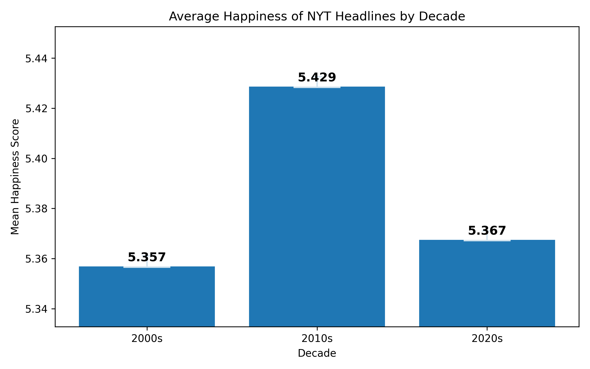
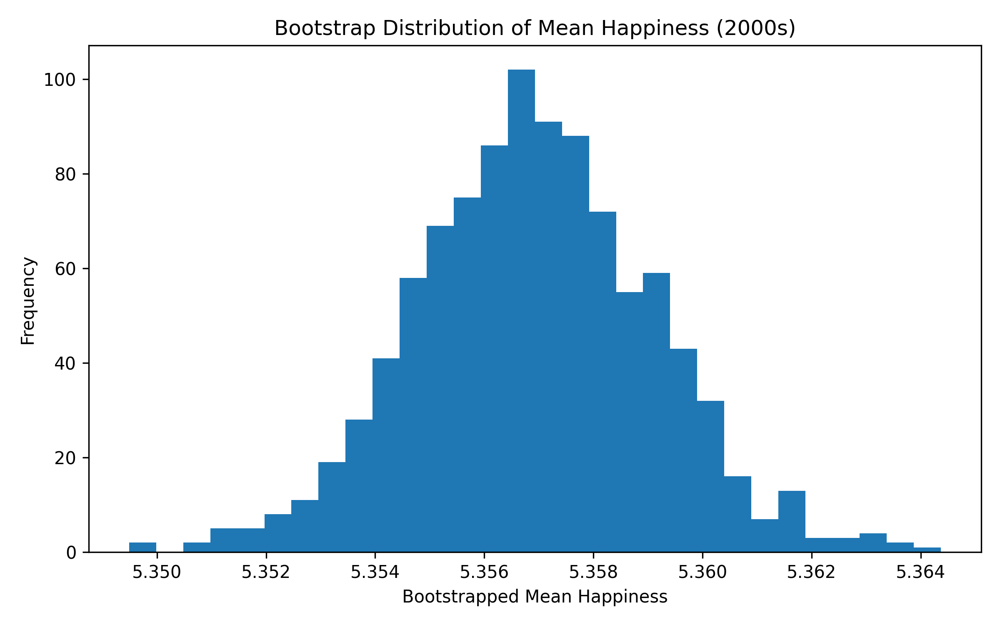
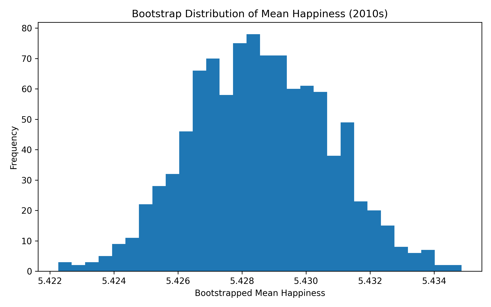
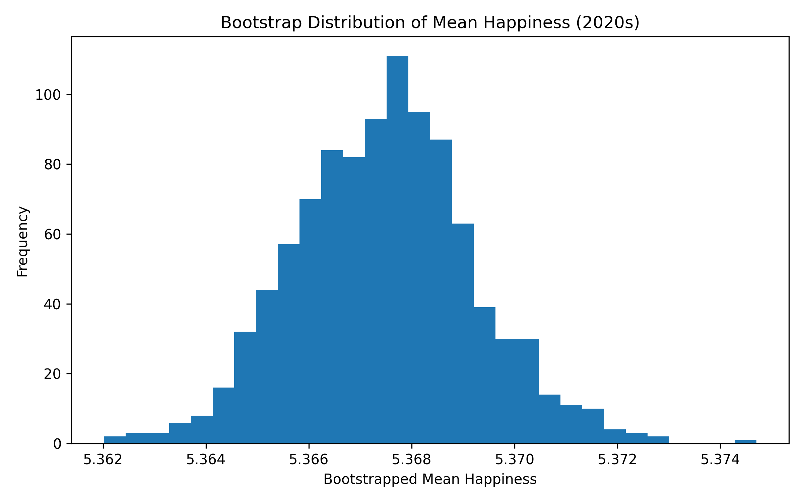

# Seminars 3 & 4 — Hedonometer (Project Folder)

This folder provides an **example project structure** (and an instructor/demo script) for the Seminars 3 & 4 group project using the **labMT 1.0** dataset (Data Set S1 from the Hedonometer paper).

It includes:
- the labMT 1.0 dataset file (`data/raw/Data_Set_S1.txt`)
- a runnable demo analysis script (`src/hedonometer_labmt_demo.py`) that produces a *typical* set of outputs aligned to the assignment
- course documents in `docs/` (original paper + paper companion + assignment + project quickstart), provided as **.pdf**

## Folder layout (course convention)

- `src/` — Python scripts you run
- `data/raw/` — input data (treat as read-only)
- `figures/` — PNG plots (embed these in your GitHub README)
- `tables/` — CSV tables/summaries (optional to embed, but useful for analysis)
- `docs/` — assignment + paper companion + quickstart handout

## Setup + run (from the project root)

### 1) Create a virtual environment

**macOS / Linux**
```bash
python3 -m venv .venv
source .venv/bin/activate
python3 -m pip install --upgrade pip
```

**Windows (PowerShell)**
```powershell
py -m venv .venv
.\.venv\Scripts\Activate.ps1
py -m pip install --upgrade pip
```

### 2) Install dependencies
```bash
python3 -m pip install -r requirements.txt
```

### 3) Run the demo analysis
```bash
python3 src/run_analysis.py
```

### What gets generated?
After running, look in:
- `figures/` — PNG plots
- `tables/` — CSV summary tables

| category                           | word       |   happiness_average |   happiness_standard_deviation |
|:-----------------------------------|:-----------|--------------------:|-------------------------------:|
| Very positive                      | laughter   |                8.5  |                         0.9313 |
| Very positive                      | happiness  |                8.44 |                         0.9723 |
| Very positive                      | love       |                8.42 |                         1.1082 |
| Very positive                      | happy      |                8.3  |                         0.9949 |
| Very positive                      | laughed    |                8.26 |                         1.1572 |
| Very negative                      | terrorist  |                1.3  |                         0.9091 |
| Very negative                      | suicide    |                1.3  |                         0.8391 |
| Very negative                      | rape       |                1.44 |                         0.7866 |
| Very negative                      | terrorism  |                1.48 |                         0.9089 |
| Very negative                      | murder     |                1.48 |                         1.015  |
| Highly contested (high SD)         | fucking    |                4.64 |                         2.926  |
| Highly contested (high SD)         | fuckin     |                3.86 |                         2.7405 |
| Highly contested (high SD)         | fucked     |                3.56 |                         2.7117 |
| Highly contested (high SD)         | pussy      |                4.8  |                         2.665  |
| Highly contested (high SD)         | whiskey    |                5.72 |                         2.6422 |
| Weird / culturally loaded (chosen) | christ     |                6.16 |                         2.3067 |
| Weird / culturally loaded (chosen) | capitalism |                5.16 |                         2.4524 |
| Weird / culturally loaded (chosen) | islam      |                4.68 |                         2.325  |
| Weird / culturally loaded (chosen) | porn       |                4.18 |                         2.4302 |
| Weird / culturally loaded (chosen) | zombies    |                4    |                         2.3733 |

<<<<<<< Updated upstream
This twenty word table shows that the LabMT happiness score collects culturally situated judgments rather than fixed emotional meanings. The words that score the highest in positive words (laughter, happiness, love, happy, laughed) are very strongly connected to feelings like joy, affection, and bonding and very clearly used in positive contexts. The very negative words on the other hand (terrorist, suicide, rape, terrorism, murder) have a very low score because they are connected to themes such as death, harm and violence, and are understood to be very negative regardless of what the context is. The “highly contested” words (fucking, fuckin, fucked, pussy, whiskey) show how disagreement can occur when the wrds used are too taboo, context dependent or slang, since slang can be used refering to sexual, humourous or insult. While whiskey can mean holding many meanings ranging to celebration, religion or addiction. And lastly, the weird/culturally loaded words (Christ, Islam, capitalism, porn, zombies) show how schools of thought, religion and certain aspects of media can shape someone’s interpretations. Religious terms on social media platforms can bring conflict or stigma to a conversation, whereas for others, it can be a form of identity expression and comfort. “Capitalism” can signal opportunity or exploitation depending on an indiciduals political stance. Words popular within pop culture, like “zombies”, can be used for entertainment in a playful manner or refer to fear, disgust or in reference to someone’s overall attitude. Hence a difference between these categories can show how the happiness score can be dependent on contextual and community based meanings as much as the disctionary meaning of certain terms. 
=======
This twenty word table shows that the LabMT happiness score collects culturally situated judgments rather than fixed emotional meanings. The words that score the highest in positive words (laughter, happiness, love, happy, laughed) are very strongly connected to feelings like joy, affection, and bonding and very clearly used in positive contexts. The very negative words on the other hand (terrorist, suicide, rape, terrorism, murder) have a very low score because they are connected to themes such as death, harm and violence, and are understood to be very negative regardless of what the context is. The “highly contested” words (fucking, fuckin, fucked, pussy, whiskey) show how disagreement can occur when the wrds used are too taboo, context dependent or slang, since slang can be used refering to sexual, humourous or insult. While whiskey can mean holding many meanings ranging to celebration, religion or addiction. And lastly, the weird/culturally loaded words (Christ, Islam, capitalism, porn, zombies) show how schools of thought, religion and certain aspects of media can shape someone’s interpretations. Religious terms on social media platforms can bring conflict or stigma to a conversation, whereas for others, it can be a form of identity expression and comfort. “Capitalism” can signal opportunity or exploitation depending on an indiciduals political stance. Words popular within pop culture, like “zombies”, can be used for entertainment in a playful manner or refer to fear, disgust or in reference to someone’s overall attitude. Hence a difference between these categories can show how the happiness score can be dependent on contextual and community based meanings as much as the disctionary meaning of certain terms. 


## Critial Reflection
### Dataset Provenance
The labMT 1.0 dataset (“language assessment by Mechanical Turk”) was created by Dodds et al. (2011) as part of their "hedonometer" work. The "hedonometer" is a tool that was designed to measure the average happiness of text collected from places like Twitter. The first thing the authors did was they selected 10,000 of the most frequently used English words and they were chosen based on how often they were used, not based on specialized words. Each word after that got rated by a few workers on Amazon Mechanical Turk on a scale from 1-9, 1 being very unhappy and 9 being very happy. Then they got these few ratings and calculated the average in order to produce a single happiness score by word. The standard deviation was then used to show the difference between the ratings. Then this word list was used to calculate the average happiness of collections of large texts by calculating an average happiness score where words that appear more often count more. In this way the dataset works as a word-based tool that measures how positive or negative large texts are.

### Limitations and Consequences
Through the labMT dataset it's possible to analyze big texts of emotional language but there are a few important things that decide what it can and cannot do. The happiness ratings were collected from Mechanical Turk workers which is a specific demographic and culture. That means that the scores are a reflection of understanding of emotion that’s not the same across the different cultures. Second, they were rated without context. Normally emotional meanings on words depend on tone, the context they were used at. The dataset simplifies emotional meaning. Third, the method uses a single numerical scale to measure a complex emotional expression. However, the design also makes the analysis easier in some ways. The dataset makes it possible for researchers to see general patterns in large positive or negative large texts, and also to compare across different texts and time periods. At the same time the limitation is that it’s difficult to capture deeper meaning, who is speaking, or how culture influences the language. Therefore, the labMT dataset is a useful but simplified measurement tool. It allows us to analyze emotional language in very large texts, but we need to question the assumptions it makes on language and emotion.


## How To Run The Code
### 1) Create A Virtual Environment
**macOS / Linux**
```bash
python3 -m venv .venv
source .venv/bin/activate
python3 -m pip install --upgrade pip
```

**Windows (PowerShell)**
```powershell
py -m venv .venv
.\.venv\Scripts\Activate.ps1
py -m pip install --upgrade pip
```

### 2) Install Dependencies
```bash
python3 -m pip install -r requirements.txt
```

### 3) Run The Analysis Scripts
Run the scripts in the following order:
```bash
python3 src/01_load_clean.py
python3 src/02_quant_analysis.py
python3 src/03_word_exhibit.py
```


## Credits
### Team Roles
#### 1. Repo & workflow lead (Yiran Wu)
- Creates the GitHub repo and folder structure.
- Manages branches / merges (or coordinates who edits which files).
- Ensures the README stays organized and readable.
- Ensures the README reads smoothly and makes a clear argument.

#### 2. Data wrangler (Yimai Liu)
- Loads the dataset, handles missing values, converts data types.
- Produces the data dictionary and “what each column means” section.

#### 3. Quantitative analyst (Chaeyun Kim)
- Leads descriptive statistics and at least 2 core plots.
- Makes sure plots have labels and captions.
- Checks results for sanity and reproducibility.

#### 4. Qualitative / close-reading lead (Duaa Khan)
- Leads careful interpretation of selected words (examples, ambiguity, cultural meaning).
- Connects qualitative observations back to patterns in the plots.

#### 5. Provenance & critique lead (Maya Yonkova)
- Reconstructs how the dataset was generated (pipeline).
- Writes the “critical reflection” sections: consequences, bias, limitations, and what the dataset makes easy/hard to see.


<<<<<<< HEAD


## Dataset
We use the labMT 1.0 dataset (Dodds et al., 2011), which includes 10,222 English words rated for happiness.

Each word has:
- An average happiness score
- A standard deviation of ratings
- Frequency ranks in four corpora:
  - Twitter
  - Google Books
  - New York Times
  - Lyrics


## Data Cleaning

The dataset was loaded as a tab-delimited file using pandas. The first two metadata rows were skipped. Missing values marked as "--" were converted to NaN.

The final dataset contains 10,222 rows and 8 columns.

We confirmed that:
- No duplicate words are present.
- All happiness-related variables are numeric.
- Rank columns contain 5,222 missing values each, indicating words not present in the top 5000 most frequent words of the respective corpus.

A cleaned dataset was saved as `data/labmt_clean.csv`.


## Data Dictionary

| Column | Type | Description | Missing Values |
|--------|------|------------|---------------|
| word | string | The English word being evaluated | 0 |
| happiness_rank | integer | Rank of the word by average happiness score (1 = happiest) | 0 |
| happiness_average | float | Mean happiness score (1–9 scale) assigned by Mechanical Turk raters | 0 |
| happiness_standard_deviation | float | Standard deviation of happiness ratings (degree of disagreement) | 0 |
| twitter_rank | float | Frequency rank of the word in Twitter (top 5000 words only) | 5222 |
| google_rank | float | Frequency rank in Google Books corpus (top 5000 words only) | 5222 |
| nyt_rank | float | Frequency rank in New York Times corpus (top 5000 words only) | 5222 |
| lyrics_rank | float | Frequency rank in song lyrics corpus (top 5000 words only) | 5222 |

The rank columns contain 5,222 missing values each. This indicates that only the top 5,000 most frequent words from each corpus were included. Words that do not appear in the top 5,000 for a given corpus are recorded as missing (NaN). These missing values therefore reflect corpus frequency thresholds rather than incomplete data collection.
=======
### Citation
This project uses the labMT 1.0 dataset introduced in:  
Dodds, P. S., Harris, K. D., Kloumann, I. M., Bliss, C. A., & Danforth, C. M. (2011). Temporal patterns of happiness and information in a global social network: Hedonometrics and Twitter. PLOS ONE, 6(12), e26752.

### AI Disclosure
- AI was used to clarify the assignment instructions and to help us understand the responsibilities of different roles.
- AI tools were used to help interpret terminal error messages and identify possible fixes.
- AI tools were occasionally used to explain Git workflows.
- AI helped us with drafting code and explanations, but we ensured we understood the meaning of each line after carefully reading and reviewing the scripts.




For comparing emotional tones within the NYT (New York Times) headlines across time we divided them into three decades: 2000's, 2010's, 2020's. Since the amount of headlines differed between the decades, to create a fair and balanced dataset we sampled the same amount of headlines from all three decades. The smallest sample decade group contained 55,417 headlines, so we decided to use this sample size for all three decades to ensure a balanced and fair comparison. We then used bootstrap resampling with 2,000 iterations to estimate the mean happiness score for each decade and calculate 95% confidence intervals.








The bootstrap distribution plots show the results of repeatedly resampling the dataset to estimate the mean happiness score for each decade. Each histogram represents the distribution of mean values obtained from 2,000 bootstrap samples

| Decade | Mean Happiness | CI Lower | CI Upper | n      |
|--------|----------------|----------|----------|--------|
| 2000s  | 5.357          | 5.353    | 5.361    | 55,417 |
| 2010s  | 5.429          | 5.424    | 5.433    | 55,417 |
| 2020s  | 5.367          | 5.364    | 5.371    | 55,417 |

The summary table presents the mean happiness score, confidence interval, and sample size for each decade. To ensure a fair comparison, an equal sample size of 55,417 headlines was used for each decade.

<<<<<<< Updated upstream
=======

## Team Roles
**Repo & workflow lead (Yiran Wu)**
- Manages branches/merges.
- Keeps the README readable.
- Enforces folder conventions.

**Data acquisition lead (Chaeyun Kim)**
- Downloads via API or dataset source.
- Writes fetch script.
- Documents provenance and ethics.

**Measurement lead (Yimai Liu)**
- Implements and tests hedonometer scoring (tokenization, matching to labMT, handling OOV words).

**Stats & sampling lead (Duaa Khan)**
- Designs sampling plan.
- Computes uncertainty (CI/bootstraps).
- Produces inference plots.

**Visualisation lead (Maya Yonkova)**
- Designs and implements optimal visualisations to back-up data-driven claims.


<br><br>

# How To Run The Code
**1) Create A Virtual Environment**  
macOS / Linux
```bash
python3 -m venv .venv
source .venv/bin/activate
python3 -m pip install --upgrade pip
```
Windows (PowerShell)
```powershell
py -m venv .venv
.\.venv\Scripts\Activate.ps1
py -m pip install --upgrade pip
```
**2) Install Dependencies**
```bash
python3 -m pip install -r requirements.txt
```
**3) Run Mini-Project 1: Exploring the labMT Lexicon**  
Run the scripts in the following order:
```bash
python3 src/01_load_clean.py
python3 src/02_quant_analysis.py
python3 src/03_word_exhibit.py
```
**4) Run Mini-Project 2: Inferring Happiness in NYT Headlines**  
Run the scripts in the following order:
```bash
python3 04_nyt_headline_collector.py
python3 05_add_year_column.py
python3 06_check_duplicates.py
python3 07_check_data.py
python3 08_compute_happiness.py
python3 09_stats_sampling.py
```

<br>

# Citation
Dodds, P. S., Harris, K. D., Kloumann, I. M., Bliss, C. A., & Danforth, C. M. (2011). Temporal patterns of happiness and information in a global social network: Hedonometrics and Twitter. PLOS ONE, 6(12), e26752.  

The New York Times. (n.d.). *Article Search API*. https://developer.nytimes.com/docs/articlesearch-product/1/overview.

<br>

# AI Disclosure
- AI was used to clarify the assignment instructions and to help us understand the responsibilities of different roles.
- AI tools were used to help interpret terminal error messages and identify possible fixes.
- AI tools were occasionally used to explain Git workflows.
- AI helped us with drafting code and explanations, but we ensured we understood the meaning of each line after carefully reading and reviewing the scripts.


project 2 sampling and method - 
For this project we used a monthly stratified sampling method, we selected up to 500 headlines for each month from September 2006 till June 2011. We did this to ensure that each time period was represented equally and also that it avoided bias from the months that had more headlines than the others.

We chose to measure the emotional tone by using the average happiness score of the headlines based off the labMT lexicon. The Words not found in the lexicon were not included from our calculation.

to analyse change/trend overtime, we used the Pearson correlation between time (monthly index) and average monthly happiness. To account for our sampling variability, we applied bootstrap resampling (1000 iterations) to estimate the confidence interval.

We also chose to group the data we collected into three periods (before, during, after) and used bootstrapping to estimate the differences in the mean happiness between these 3 periods.


project 1 new analysis -
This twenty word table we have created shows that the LabMT happiness score collects culturally situated judgments rather than fixed emotional meanings. The words that scored with the highest happiness scores (e.g., laughter = 8.50, happiness = 8.44, love = 8.42) are strongly associated with joy, affection, social bonding, and are consistently interpreted as something positive. The very negative words on the other hand (e.g., terrorist = 1.30, suicide = 1.30, rape = 1.44) have a very low score because they are connected to themes such as death, harm and violence, and are understood to be very negative regardless of what the context usually is. 

The “highly contested” words (e.g., fucking SD = 2.93, fuckin SD = 2.74, fucked SD = 2.71) show how disagreement can occur when the words used are too taboo, context dependent or slang, since slang can be used refering to sexual, humourous or insult, which leads to variation in how they are interpreted. For example, whiskey (mean = 5.72, SD = 2.64) may be associated with celebration and social bonding for some, but when it comes to religion (mostly prohibition) addiction or harm to others, can explain its high level of disagreement.

And lastly, the weird/culturally loaded words (e.g., Christ mean = 6.16, SD = 2.3; capitalism mean = 5.16, SD = 2.45; Islam mean = 4.68, SD = 2.33; porn mean = 4.18, SD = 2.43; Zombies mean = 4 SD = 2.37) show how schools of thought, religion and certain aspects of media may shape someone’s interpretations. Religious words and conversations on social media platforms usually bring conflict or stigma to a conversation more than a positive shared experience, whereas for other words, it may be a form of identity or comfort. The word “Capitalism” may be signal opportunity or exploitation depending on an individuals political stance, since its in the mid mean range it could mean that a mix of individuals with different political stances about capitalism. Lastly words that are popular within pop culture, like “zombies”, can be used for either entertainment in a playful manner, to express fear for them, disgust or refering to someone as a "zombie" based on their attitude or behaviour. Hence a difference between these categories can show how the happiness score can be dependent on contextual and community based meanings as much as the disctionary meaning of certain terms. 

Overall the patterns we noticed show that higher disagreement (standard deviation) is linked to words with more ambiguity and context, whereas words that are universally understood tend to either have both extreme scores and/or lower variability. Suggesting that the emotional meaning of words within the dataset is shaped by the words but also by the perspectives of the people who used/ranked them. Since the ratings that were collected and we are using are from Mechanical Turk workers, so the dataset most likely reflects the cultural and ideological biases of the specific group of raters rather than a universal measure of these words.
>>>>>>> Stashed changes
