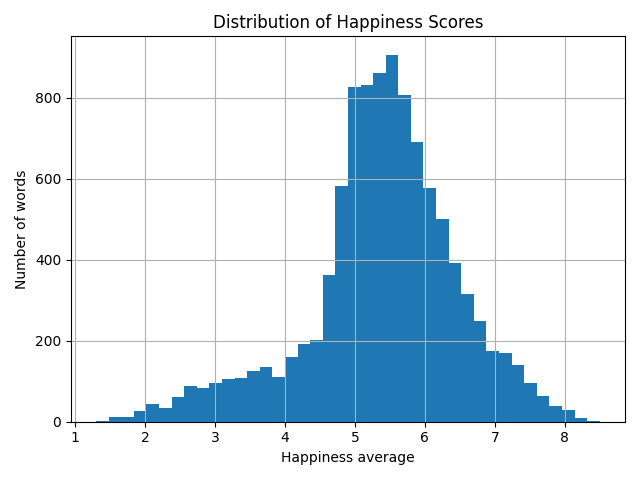
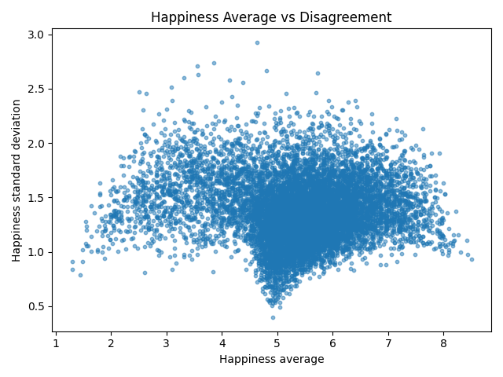
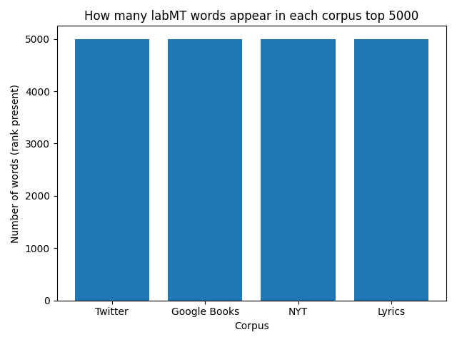
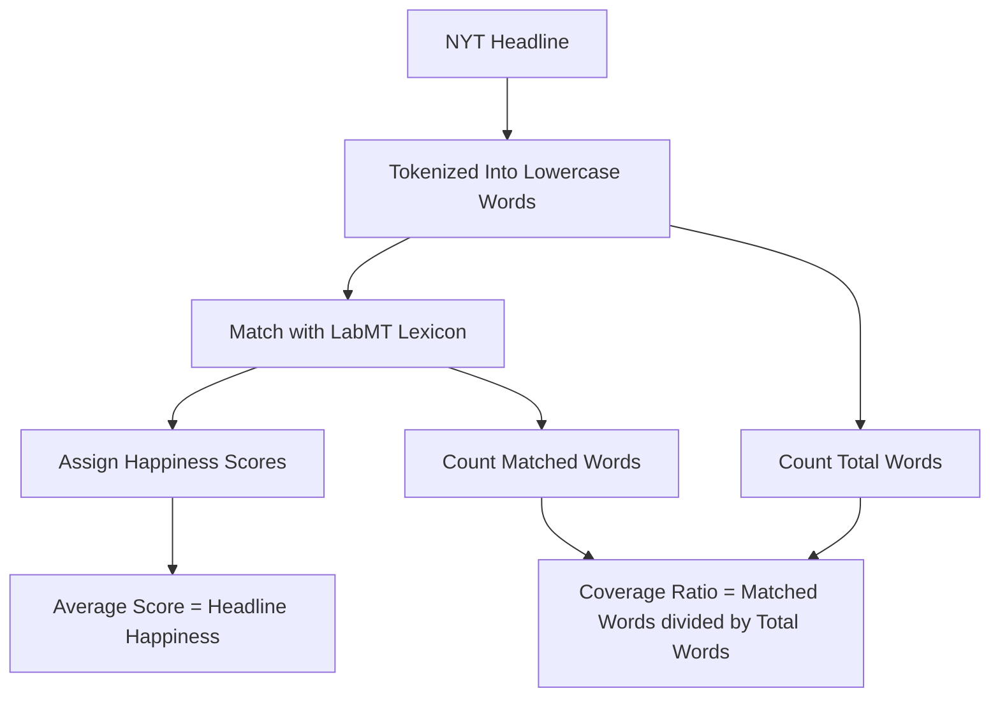

# Hedonometer Project
### Mini-Project 1: Exploring the labMT Lexicon
In this mini-project, we analyses the labMT 1.0 dataset, a collection of English words rated for happiness by crowd workers. We use Python to clean the data and explore patterns in happiness scores and word usage across several text corpora. We then combine quantitative plots with qualitative interpretation to examine how emotional meaning in language depends on context and cultural perspective.

### Mini-Project 2: Inferring Happiness in NYT Headlines
In this mini-project, we use the labMT 1.0 hedonometer as a measurement instrument to analyze the emotional tone of New York Times headlines. Headlines are collected through the NYT Article Search API, and their happiness scores are computed by matching words with the labMT lexicon. We then compare the average happiness scores of headlines across the selected years to examine how their emotional tone changes over time.


# Mini-Project 1️⃣: Exploring the labMT Lexicon
## Dataset
### Source
We use the labMT 1.0 dataset (Dodds et al., 2011), which includes 10,222 English words rated for happiness.

Each word has:
- An average happiness score
- A standard deviation of ratings
- Frequency ranks in four corpora:
  - Twitter
  - Google Books
  - New York Times
  - Lyrics

### Data Dictionary
Below is a description of each column in the dataset, including its meaning, data type, and notes on missing values.
| Column | Type | Meaning | Missing Values |
|------|------|------|------|
| word | string | The English word being evaluated in the dataset | None |
| happiness_rank | integer | Rank of the word based on its average happiness score (1 = highest happiness score) | None |
| happiness_average | float | Average happiness score assigned by Mechanical Turk raters on a 1–9 scale | None |
| happiness_standard_deviation | float | Standard deviation of happiness ratings, indicating disagreement among raters | None |
| twitter_rank | float | Frequency rank of the word in the Twitter corpus | 5,222 missing values (words not in the top 5,000) |
| google_rank | float | Frequency rank of the word in the Google Books corpus | 5,222 missing values (words not in the top 5,000) |
| nyt_rank | float | Frequency rank of the word in the New York Times corpus | 5,222 missing values (words not in the top 5,000) |
| lyrics_rank | float | Frequency rank of the word in the song lyrics corpus | 5,222 missing values (words not in the top 5,000) |


## Methods
### Data Cleaning
The dataset was loaded as a tab-delimited file using pandas. The first two metadata rows were skipped. Missing values marked as "--" were converted to NaN.

The final dataset contains 10,222 rows and 8 columns.

We confirmed that:
- No duplicate words are present.
- All happiness-related variables are numeric.
- Rank columns contain 5,222 missing values each, indicating words not present in the top 5000 most frequent words of the respective corpus.

A cleaned dataset was saved as `data/labmt_clean.csv`.

### What We Did
In our own analysis we treated the labMT file as a tab-delimited dataset. We skipped the initial metadata lines, we converted the placeholder value “--” into missing values, and we converted the rank and happiness columns into real numbers so that we could calculate averages and create plots. We didn’t remove neutral words from the middle of the happiness scale. We analyzed the full distribution of happiness_average. We treated each word as having one fixed happiness score and also looked at how much raters opinions about words differentiated by using standard deviation. The missing rank values were interpreted as “not in the top-5000 list for that corpus,” and we handled missing values differently depending on the task. These decisions affect the analysis of our results. We are describing patterns in the word list and how it appears across different text collections. We are not measuring the emotional tone of a specific text collection.


## Results
### 1. Distribution of Happiness Scores


The histogram shows the distribution of happiness scores across the labMT lexicon. Most words cluster around the middle of the scale, with many values between about 4 and 7. Extremely positive and extremely negative words are less common, indicating that most words in the lexicon express moderate emotional valence rather than strong positivity or negativity.

### 2. Happiness vs Disagreement


The scatter plot compares the average happiness score of each word with the level of disagreement among raters (standard deviation). Words with mid-range happiness scores tend to show greater disagreement, suggesting that they are more context-dependent or culturally contested. In contrast, words with very high or very low happiness scores often have lower disagreement, indicating stronger consensus about their emotional meaning.

### 3. Corpus Comparison


We compare how “common language” differs across four corpora: Twitter, Google Books, the New York Times, and song lyrics. Each rank column in the labMT dataset contains exactly the top 5000 words for that corpus, so simply counting non-missing values yields 5000 words for each source. For this reason, meaningful differences between corpora are better understood by examining overlap rather than raw counts.

We find that only 2,881 words appear in both the Twitter and NYT top-5000 lists, and just 1,816 words appear in all four corpora. This indicates that what counts as “common” language varies substantially depending on where the language is observed.

As a concrete example, laughter appears in the Twitter top-5000 list but not in the NYT top-5000 list. This likely reflects differences in register and usage: Twitter language tends to include more informal and emotionally expressive vocabulary, whereas newspaper language favors a more formal style.


## Qualitative “Exhibit” of Words
| category                           | word       |   happiness_average |   happiness_standard_deviation |
|:-----------------------------------|:-----------|--------------------:|-------------------------------:|
| Very positive                      | laughter   |                8.5  |                         0.9313 |
| Very positive                      | happiness  |                8.44 |                         0.9723 |
| Very positive                      | love       |                8.42 |                         1.1082 |
| Very positive                      | happy      |                8.3  |                         0.9949 |
| Very positive                      | laughed    |                8.26 |                         1.1572 |
| Very negative                      | terrorist  |                1.3  |                         0.9091 |
| Very negative                      | suicide    |                1.3  |                         0.8391 |
| Very negative                      | rape       |                1.44 |                         0.7866 |
| Very negative                      | terrorism  |                1.48 |                         0.9089 |
| Very negative                      | murder     |                1.48 |                         1.015  |
| Highly contested (high SD)         | fucking    |                4.64 |                         2.926  |
| Highly contested (high SD)         | fuckin     |                3.86 |                         2.7405 |
| Highly contested (high SD)         | fucked     |                3.56 |                         2.7117 |
| Highly contested (high SD)         | pussy      |                4.8  |                         2.665  |
| Highly contested (high SD)         | whiskey    |                5.72 |                         2.6422 |
| Weird / culturally loaded (chosen) | christ     |                6.16 |                         2.3067 |
| Weird / culturally loaded (chosen) | capitalism |                5.16 |                         2.4524 |
| Weird / culturally loaded (chosen) | islam      |                4.68 |                         2.325  |
| Weird / culturally loaded (chosen) | porn       |                4.18 |                         2.4302 |
| Weird / culturally loaded (chosen) | zombies    |                4    |                         2.3733 |

This twenty word table shows that the LabMT happiness score collects culturally situated judgments rather than fixed emotional meanings. The words that score the highest in positive words (laughter, happiness, love, happy, laughed) are very strongly connected to feelings like joy, affection, and bonding and very clearly used in positive contexts. The very negative words on the other hand (terrorist, suicide, rape, terrorism, murder) have a very low score because they are connected to themes such as death, harm and violence, and are understood to be very negative regardless of what the context is. The “highly contested” words (fucking, fuckin, fucked, pussy, whiskey) show how disagreement can occur when the wrds used are too taboo, context dependent or slang, since slang can be used refering to sexual, humourous or insult. While whiskey can mean holding many meanings ranging to celebration, religion or addiction. And lastly, the weird/culturally loaded words (Christ, Islam, capitalism, porn, zombies) show how schools of thought, religion and certain aspects of media can shape someone’s interpretations. Religious terms on social media platforms can bring conflict or stigma to a conversation, whereas for others, it can be a form of identity expression and comfort. “Capitalism” can signal opportunity or exploitation depending on an indiciduals political stance. Words popular within pop culture, like “zombies”, can be used for entertainment in a playful manner or refer to fear, disgust or in reference to someone’s overall attitude. Hence a difference between these categories can show how the happiness score can be dependent on contextual and community based meanings as much as the disctionary meaning of certain terms. 


## Critial Reflection
### Dataset Provenance
The labMT 1.0 dataset (“language assessment by Mechanical Turk”) was created by Dodds et al. (2011) as part of their "hedonometer" work. The "hedonometer" is a tool that was designed to measure the average happiness of text collected from places like Twitter. The first thing the authors did was they selected 10,000 of the most frequently used English words and they were chosen based on how often they were used, not based on specialized words. Each word after that got rated by a few workers on Amazon Mechanical Turk on a scale from 1-9, 1 being very unhappy and 9 being very happy. Then they got these few ratings and calculated the average in order to produce a single happiness score by word. The standard deviation was then used to show the difference between the ratings. Then this word list was used to calculate the average happiness of collections of large texts by calculating an average happiness score where words that appear more often count more. In this way the dataset works as a word-based tool that measures how positive or negative large texts are.

### Limitations and Consequences
Through the labMT dataset it's possible to analyze big texts of emotional language but there are a few important things that decide what it can and cannot do. The happiness ratings were collected from Mechanical Turk workers which is a specific demographic and culture. That means that the scores are a reflection of understanding of emotion that’s not the same across the different cultures. Second, they were rated without context. Normally emotional meanings on words depend on tone, the context they were used at. The dataset simplifies emotional meaning. Third, the method uses a single numerical scale to measure a complex emotional expression. However, the design also makes the analysis easier in some ways. The dataset makes it possible for researchers to see general patterns in large positive or negative large texts, and also to compare across different texts and time periods. At the same time the limitation is that it’s difficult to capture deeper meaning, who is speaking, or how culture influences the language. Therefore, the labMT dataset is a useful but simplified measurement tool. It allows us to analyze emotional language in very large texts, but we need to question the assumptions it makes on language and emotion.


## How To Run The Code
### 1) Create A Virtual Environment
**macOS / Linux**
```bash
python3 -m venv .venv
source .venv/bin/activate
python3 -m pip install --upgrade pip
```

**Windows (PowerShell)**
```powershell
py -m venv .venv
.\.venv\Scripts\Activate.ps1
py -m pip install --upgrade pip
```

### 2) Install Dependencies
```bash
python3 -m pip install -r requirements.txt
```

### 3) Run The Analysis Scripts
Run the scripts in the following order:
```bash
python3 src/01_load_clean.py
python3 src/02_quant_analysis.py
python3 src/03_word_exhibit.py
```

## Credits
### Team Roles
#### 1. Repo & workflow lead (Yiran Wu)
- Creates the GitHub repo and folder structure.
- Manages branches / merges (or coordinates who edits which files).
- Ensures the README stays organized and readable.
- Ensures the README reads smoothly and makes a clear argument.

#### 2. Data wrangler (Yimai Liu)
- Loads the dataset, handles missing values, converts data types.
- Produces the data dictionary and “what each column means” section.

#### 3. Quantitative analyst (Chaeyun Kim)
- Leads descriptive statistics and at least 2 core plots.
- Makes sure plots have labels and captions.
- Checks results for sanity and reproducibility.

#### 4. Qualitative / close-reading lead (Duaa Khan)
- Leads careful interpretation of selected words (examples, ambiguity, cultural meaning).
- Connects qualitative observations back to patterns in the plots.

#### 5. Provenance & critique lead (Maya Yonkova)
- Reconstructs how the dataset was generated (pipeline).
- Writes the “critical reflection” sections: consequences, bias, limitations, and what the dataset makes easy/hard to see.


### Citation
This project uses the labMT 1.0 dataset introduced in:  
Dodds, P. S., Harris, K. D., Kloumann, I. M., Bliss, C. A., & Danforth, C. M. (2011). Temporal patterns of happiness and information in a global social network: Hedonometrics and Twitter. PLOS ONE, 6(12), e26752.


### AI Disclosure
- AI was used to clarify the assignment instructions and to help us understand the responsibilities of different roles.
- AI tools were used to help interpret terminal error messages and identify possible fixes.
- AI tools were occasionally used to explain Git workflows.
- AI helped us with drafting code and explanations, but we ensured we understood the meaning of each line after carefully reading and reviewing the scripts.


# Mini-Project 2️⃣: Exploring the labMT Lexicon

## Research Question
How has the emotional tone of New York Times headlines changed over time?

## Dataset


## Measurement
In this part, we measure the emotional tone of New York Times headlines using the LabMT sentiment lexicon. Our dataset contains NYT headlines from three different years (2000, 2010, and 2020), which allows us to compare how the emotional tone of headlines may have changed over time.

### Method
The emotional tone of each headline is computed using the following pipeline:



### Output
The processed dataset is saved as `data/nyt_headlines_scored_v2.csv`.

This dataset contains the following variables:
| Column | Description |
|------|------|
| headline | NYT article headline |
| pub_date | Original publication date |
| year | Extracted year from the publication date |
| happiness_score | Average labMT happiness score of matched words |
| matched_words | Number of words in the headline found in the labMT lexicon |
| total_words | Total number of words in the headline |
| coverage_ratio | Proportion of words matched with the lexicon |


This dataset will be used in the next stage to design the sampling strategy, compute uncertainty measures, and produce statistical inference plots to compare the emotional tone of headlines across the selected years.


## Credits
### Team Roles
#### 1. Repo & workflow lead (Yiran Wu)
- Manages branches/merges.
- Keeps the README readable.
- Enforces folder conventions.

#### 2. Data acquisition lead (Chaeyun Kim)
- Downloads via API or dataset source.
- writes fetch script.
- Documents provenance and ethics.

#### 3. Measurement lead (Yimai Liu)
- Implements and tests hedonometer scoring (tokenization, matching to labMT , handling OOV words).

#### 4. Stats & sampling lead (Duaa Khan)
- Designs sampling plan.
- Computes uncertainty (CI/bootstraps).
- Produces inference plots.

#### 5. Visualisation lead (Maya Yonkova)
- Designs and implements optimal visualisations to back-up data-driven claims.

### Citation
This project uses data collected from the New York Times Article Search API.

The New York Times. (n.d.). *Article Search API*. https://developer.nytimes.com/docs/articlesearch-product/1/overview.

### AI Disclosure
- AI was used to clarify the assignment instructions and to help us understand the responsibilities of different roles.
- AI tools were used to help interpret terminal error messages and identify possible fixes.
- AI tools were occasionally used to explain Git workflows.
- AI helped us with drafting code and explanations, but we ensured we understood the meaning of each line after carefully reading and reviewing the scripts.

