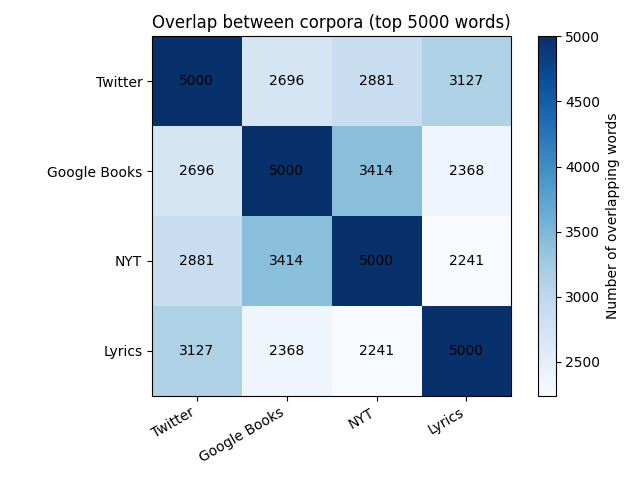

# Hedonometer Project
This project analyses the labMT 1.0 dataset, a collection of English words rated for happiness by crowd workers. We use Python to clean the data and explore patterns in happiness scores and word usage across several text corpora. We then combine quantitative plots with qualitative interpretation to examine how emotional meaning in language depends on context and cultural perspective.


## Dataset
### Source
We use the labMT 1.0 dataset (Dodds et al., 2011), which includes 10,222 English words rated for happiness.

Each word has:
- An average happiness score
- A standard deviation of ratings
- Frequency ranks in four corpora:
  - Twitter
  - Google Books
  - New York Times
  - Lyrics

### Columns
Below is a description of each column in the dataset, including its meaning, data type, and notes on missing values.

#### Word
  - Type: string  
  - Meaning: the English word being evaluated in the dataset.  
  - Missingness: no missing values.

#### Happiness_rank
  - Type: integer  
  - Meaning: the rank of the word based on its average happiness score (1 indicates the highest happiness score).  
  - Missingness: no missing values.

#### Happiness_average
  - Type: float  
  - Meaning: the average happiness score assigned to the word by Mechanical Turk raters on a 1–9 scale.  
  - Missingness: no missing values.

#### Happiness_standard_deviation
  - Type: float  
  - Meaning: the standard deviation of happiness ratings, indicating the level of disagreement among raters.  
  - Missingness: no missing values.

#### Twitter_rank
  - Type: float  
  - Meaning: the frequency rank of the word in the Twitter corpus.  
  - Missingness: contains 5,222 missing values because only the top 5,000 most frequent words in the corpus are ranked.

#### Google_rank 
  - Type: float  
  - Meaning: the frequency rank of the word in the Google Books corpus.  
  - Missingness: contains 5,222 missing values for words not appearing in the top 5,000.

#### NYT_rank
  - Type: float  
  - Meaning: the frequency rank of the word in the New York Times corpus.  
  - Missingness: contains 5,222 missing values for words not appearing in the top 5,000.

#### Lyrics_rank
  - Type: float  
  - Meaning: the frequency rank of the word in the song lyrics corpus.  
  - Missingness: contains 5,222 missing values for words not appearing in the top 5,000.


## Methods
### Data Cleaning
The dataset was loaded as a tab-delimited file using pandas. The first two metadata rows were skipped. Missing values marked as "--" were converted to NaN.

The final dataset contains 10,222 rows and 8 columns.

We confirmed that:
- No duplicate words are present.
- All happiness-related variables are numeric.
- Rank columns contain 5,222 missing values each, indicating words not present in the top 5000 most frequent words of the respective corpus.

A cleaned dataset was saved as `data/labmt_clean.csv`.

### What We Did
In our own analysis we treated the labMT file as a tab-delimited dataset. We skipped the initial metadata lines, we converted the placeholder value “--” into missing values, and we converted the rank and happiness columns into real numbers so that we could calculate averages and create plots. We didn’t remove neutral words from the middle of the happiness scale. We analyzed the full distribution of happiness_average. We treated each word as having one fixed happiness score and also looked at how much raters opinions about words differentiated by using standard deviation. The missing rank values were interpreted as “not in the top-5000 list for that corpus,” and we handled missing values differently depending on the task. These decisions affect the analysis of our results. We are describing patterns in the word list and how it appears across different text collections. We are not measuring the emotional tone of a specific text collection.


## Results
### 1. Distribution of Happiness Scores


To understand the overall structure of the dataset, we examine the distribution of happiness scores using both summary statistics and a histogram. The mean happiness score is approximately 5.38, and the median is very close to this value, indicating that the distribution is centered around the middle of the scale. The standard deviation is about 1.08, suggesting a moderate spread in the data.

The range of values extends from approximately 1.3 to 8.5, showing that the lexicon includes both very negative and very positive words. However, the 5th and 95th percentiles (around 3.18 and 7.08) indicate that most words fall within a narrower central interval, with relatively few extreme values.

Visually, the histogram shows that the distribution is not perfectly symmetric. While it is roughly bell-shaped, there is a slight skew toward higher (more positive) values, meaning that moderately positive words are more common than strongly negative ones. The right tail extends into high happiness scores, but both tails are relatively thin, indicating that extreme values are less frequent.

Overall, the distribution suggests that language in the labMT lexicon is concentrated around neutral to moderately positive emotional values, with fewer words expressing strong negativity or extreme positivity. This pattern implies a bias toward mildly positive expression in commonly used language.

### 2. Happiness vs Disagreement


We examine the relationship between happiness scores and disagreement (standard deviation) using a scatterplot. While one might initially expect that words with very high or very low happiness scores would have more consistent evaluations, the plot suggests the opposite pattern.

The scatterplot shows a clear fan-shaped distribution. Words near the neutral midpoint (around a happiness score of 5) tend to have lower disagreement, while words further away from neutrality—either more positive or more negative—exhibit higher levels of disagreement. This indicates that variability in ratings increases as words become more emotionally extreme.

To make this pattern more interpretable, we label several key words directly on the plot. For example, *suicide* (the most negative word, happiness ≈ 1.3) and *laughter* (the most positive word, happiness ≈ 8.5) both lie toward the edges of the distribution, where disagreement begins to increase. More strikingly, words such as *fucking* and *fuckin* have some of the highest disagreement values (standard deviation ≈ 2.9 and 2.74), despite not being the most extreme in terms of happiness. These words are likely interpreted differently depending on context, tone, or speaker intention.

The presence of such outliers highlights that disagreement is not driven solely by positivity or negativity, but also by ambiguity, slang usage, and cultural factors. Words with multiple meanings or strong emotional connotations tend to produce less consistent evaluations across annotators.

The plot suggests that emotional intensity and contextual variability are closely linked: as words become more emotionally charged or context-dependent, agreement between raters decreases. This demonstrates that affective meaning in language is not fixed, but shaped by interpretation and usage.

### 3. Corpus Comparison


To better understand how “common language” varies across contexts, we compare the overlap between the top 5000 words in four corpora: Twitter, Google Books, the New York Times (NYT), and song lyrics. Because each corpus is constructed from its own top-5000 list, raw counts are not informative; instead, we examine how many words overlap between corpora.

The heatmap shows that overlap varies substantially across pairs. Google Books and NYT share the highest overlap (3414 words), suggesting that both corpora reflect more formal, written language. In contrast, NYT and Lyrics have the lowest overlap (2241 words), indicating a strong difference in register: news language is more formal and informational, while lyrics tend to be more emotional and stylistically expressive.

Twitter occupies an intermediate position. Its overlap with Lyrics (3127 words) is relatively high, reflecting shared informal and conversational elements, while its overlap with NYT (2881 words) is lower but still substantial. This suggests that Twitter contains a mix of informal expression and informational language.

Overall, the results demonstrate that what counts as “common language” depends strongly on the corpus. Even when each corpus includes 5000 high-frequency words, the overlap between them is far from complete, highlighting differences in style, context, and usage across domains.


## Qualitative “Exhibit” of Words
| category                           | word       |   happiness_average |   happiness_standard_deviation |
|:-----------------------------------|:-----------|--------------------:|-------------------------------:|
| Very positive                      | laughter   |                8.5  |                         0.9313 |
| Very positive                      | happiness  |                8.44 |                         0.9723 |
| Very positive                      | love       |                8.42 |                         1.1082 |
| Very positive                      | happy      |                8.3  |                         0.9949 |
| Very positive                      | laughed    |                8.26 |                         1.1572 |
| Very negative                      | terrorist  |                1.3  |                         0.9091 |
| Very negative                      | suicide    |                1.3  |                         0.8391 |
| Very negative                      | rape       |                1.44 |                         0.7866 |
| Very negative                      | terrorism  |                1.48 |                         0.9089 |
| Very negative                      | murder     |                1.48 |                         1.015  |
| Highly contested (high SD)         | fucking    |                4.64 |                         2.926  |
| Highly contested (high SD)         | fuckin     |                3.86 |                         2.7405 |
| Highly contested (high SD)         | fucked     |                3.56 |                         2.7117 |
| Highly contested (high SD)         | pussy      |                4.8  |                         2.665  |
| Highly contested (high SD)         | whiskey    |                5.72 |                         2.6422 |
| Weird / culturally loaded (chosen) | christ     |                6.16 |                         2.3067 |
| Weird / culturally loaded (chosen) | capitalism |                5.16 |                         2.4524 |
| Weird / culturally loaded (chosen) | islam      |                4.68 |                         2.325  |
| Weird / culturally loaded (chosen) | porn       |                4.18 |                         2.4302 |
| Weird / culturally loaded (chosen) | zombies    |                4    |                         2.3733 |

This twenty word table shows that the LabMT happiness score collects culturally situated judgments rather than fixed emotional meanings. The words that score the highest in positive words (laughter, happiness, love, happy, laughed) are very strongly connected to feelings like joy, affection, and bonding and very clearly used in positive contexts. The very negative words on the other hand (terrorist, suicide, rape, terrorism, murder) have a very low score because they are connected to themes such as death, harm and violence, and are understood to be very negative regardless of what the context is. The “highly contested” words (fucking, fuckin, fucked, pussy, whiskey) show how disagreement can occur when the wrds used are too taboo, context dependent or slang, since slang can be used refering to sexual, humourous or insult. While whiskey can mean holding many meanings ranging to celebration, religion or addiction. And lastly, the weird/culturally loaded words (Christ, Islam, capitalism, porn, zombies) show how schools of thought, religion and certain aspects of media can shape someone’s interpretations. Religious terms on social media platforms can bring conflict or stigma to a conversation, whereas for others, it can be a form of identity expression and comfort. “Capitalism” can signal opportunity or exploitation depending on an indiciduals political stance. Words popular within pop culture, like “zombies”, can be used for entertainment in a playful manner or refer to fear, disgust or in reference to someone’s overall attitude. Hence a difference between these categories can show how the happiness score can be dependent on contextual and community based meanings as much as the disctionary meaning of certain terms. 


## Critial Reflection
### Dataset Provenance
The labMT 1.0 dataset (“language assessment by Mechanical Turk”) was created by Dodds et al. (2011) as part of their "hedonometer" work. The "hedonometer" is a tool that was designed to measure the average happiness of text collected from places like Twitter. The first thing the authors did was they selected 10,000 of the most frequently used English words and they were chosen based on how often they were used, not based on specialized words. Each word after that got rated by a few workers on Amazon Mechanical Turk on a scale from 1-9, 1 being very unhappy and 9 being very happy. Then they got these few ratings and calculated the average in order to produce a single happiness score by word. The standard deviation was then used to show the difference between the ratings. Then this word list was used to calculate the average happiness of collections of large texts by calculating an average happiness score where words that appear more often count more. In this way the dataset works as a word-based tool that measures how positive or negative large texts are.

### Limitations and Consequences
Through the labMT dataset it's possible to analyze big texts of emotional language but there are a few important things that decide what it can and cannot do. The happiness ratings were collected from Mechanical Turk workers which is a specific demographic and culture. That means that the scores are a reflection of understanding of emotion that’s not the same across the different cultures. Second, they were rated without context. Normally emotional meanings on words depend on tone, the context they were used at. The dataset simplifies emotional meaning. Third, the method uses a single numerical scale to measure a complex emotional expression. However, the design also makes the analysis easier in some ways. The dataset makes it possible for researchers to see general patterns in large positive or negative large texts, and also to compare across different texts and time periods. At the same time the limitation is that it’s difficult to capture deeper meaning, who is speaking, or how culture influences the language. Therefore, the labMT dataset is a useful but simplified measurement tool. It allows us to analyze emotional language in very large texts, but we need to question the assumptions it makes on language and emotion.


## How To Run The Code
### 1) Create A Virtual Environment
**macOS / Linux**
```bash
python3 -m venv .venv
source .venv/bin/activate
python3 -m pip install --upgrade pip
```

**Windows (PowerShell)**
```powershell
py -m venv .venv
.\.venv\Scripts\Activate.ps1
py -m pip install --upgrade pip
```

### 2) Install Dependencies
```bash
python3 -m pip install -r requirements.txt
```

### 3) Run The Analysis Scripts
Run the scripts in the following order:
```bash
python3 src/01_load_clean.py
python3 src/02_quant_analysis.py
python3 src/03_word_exhibit.py
```


## Credits
### Team Roles
#### 1. Repo & workflow lead (Yiran Wu)
- Creates the GitHub repo and folder structure.
- Manages branches / merges (or coordinates who edits which files).
- Ensures the README stays organized and readable.
- Ensures the README reads smoothly and makes a clear argument.

#### 2. Data wrangler (Yimai Liu)
- Loads the dataset, handles missing values, converts data types.
- Produces the data dictionary and “what each column means” section.

#### 3. Quantitative analyst (Chaeyun Kim)
- Leads descriptive statistics and at least 2 core plots.
- Makes sure plots have labels and captions.
- Checks results for sanity and reproducibility.

#### 4. Qualitative / close-reading lead (Duaa Khan)
- Leads careful interpretation of selected words (examples, ambiguity, cultural meaning).
- Connects qualitative observations back to patterns in the plots.

#### 5. Provenance & critique lead (Maya Yonkova)
- Reconstructs how the dataset was generated (pipeline).
- Writes the “critical reflection” sections: consequences, bias, limitations, and what the dataset makes easy/hard to see.


### Citation
This project uses the labMT 1.0 dataset introduced in:  
Dodds, P. S., Harris, K. D., Kloumann, I. M., Bliss, C. A., & Danforth, C. M. (2011). Temporal patterns of happiness and information in a global social network: Hedonometrics and Twitter. PLOS ONE, 6(12), e26752.

### AI Disclosure
- AI was used to clarify the assignment instructions and to help us understand the responsibilities of different roles.
- AI tools were used to help interpret terminal error messages and identify possible fixes.
- AI tools were occasionally used to explain Git workflows.
- AI helped us with drafting code and explanations, but we ensured we understood the meaning of each line after carefully reading and reviewing the scripts.